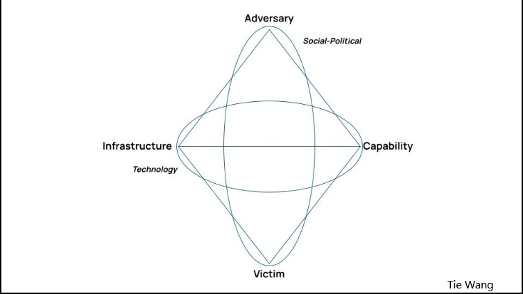
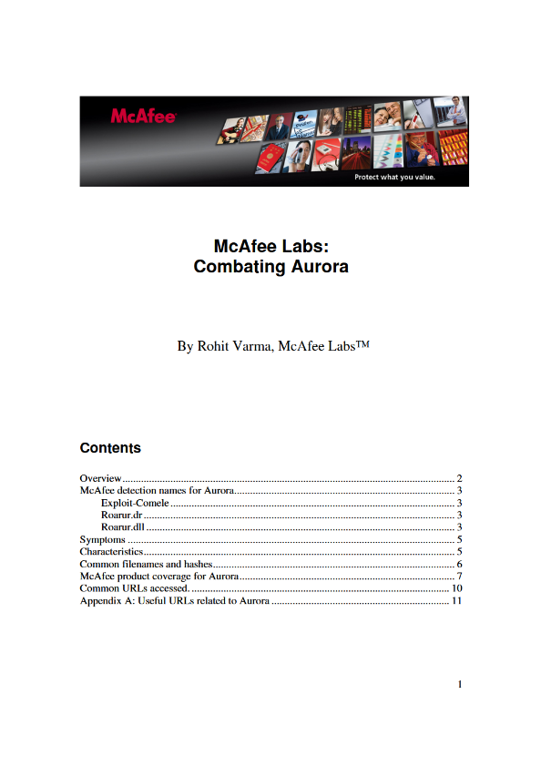

# Diamond Model

## Task 1 Introduction to the Diamond Model

This is a structural model which is used to analyze cyber attacks, threaten behaviors, and intrusion event in cybersecurity industry. It has 4 vertexes Adversary, Capability, Infrastructure, and Victim

- Adversary  - Attackers Profile
- Capability - Attacking tools, software, and techniques. Such as malicious code.
- Infrastructure - Facilities which are used to attack. Such as servers.
- Victim - People or organizations who suffer it.

## Task 2 Select a Real-World Threat Report

​	**Title** : Combating Aurora

​	**Source**: McAfee

## Task 3 Diamond Model Vertex Extraction

|                |                                                              |
| -------------- | ------------------------------------------------------------ |
| Adversary      | not provided                                                 |
| Capability     | malicious script : Exploit-Comele Trojan: Roarur.dr and Roarur.dll |
| Infrastructure | a list of domains and IPs 360.homeunix.com 69.164.192.4 alt1.homelinux.com amt1.homelinux.com aop1.homelinux.com app1.homelinux.com blogspot.blogsite.org filoups.info ftp2.homeunix.com ftpaccess.cc google.homeunix.com and so forth |
| Victim         | Some large corporations and organizations such as Google and Microsoft found it firstly All the users who use IE browsers will be influenced afterwards. |

## Task 4 Create a Diamond Diagram

## Task 5 Threat Actor Profile Summary

Operation Aurora was a cyberattack from an unknown threat actor, and until now nobody can say for sure who did it. Some big companies, such as Google and Microsoft got the attack firstly, and many individual Internet Explore users also became possible victims if they didn’t patch their system, after the exploit code was deployed to some websites. 

The initial attack method leverage a zero-day vulnerability in Internet Explorer (CVE-2010-0249). The exploit will be launched automatically when the victim visit the website. After that, some malware files like Exploit-Comele, Roarur.dr, and Roarur.dll got installed on the machine to help the attacker stay inside the system and keep access for later. 

In the Diamond Model, the threat actor is unknown. The capabilities include the zero-day exploit and the malware tools. The infrastructure was several malicious websites and dynamic DNS domains used for hosting and delivering the payload. The victims at first were big companies, but later also regular users once the exploit became widely shared online. 

For mitigation, the report mentioned installing Microsoft updates, enabling DEP, blocking the known domains, and doing full antivirus scans. McAfee also released new signatures and a tool to remove Aurora-related files

## Task 6 Reflection Questions
1. How does the Diamond Model help in understanding threat actors?

   The diamond model helps us to divide a cyberattack into 4 parts so that we will not only look at one or two details, but understand the whole scenario as well. We may recognize attacker, tools, targets and how the attack is delivered clearly by leveraging this model.

2. What challenges did you face in identifying each vertex?
   The most challenge is how to recognize what is a infrastructure and what is a capability, because sometimes the malware is stored or delivered through the server, so it feels like they are the same thing. I needed to remind myself that capability is the tool itself, and infrastructure is just where it is hosted or used, not part of the tool.

3. How could this model support proactive defense strategies?
   This model can help because if we understand how attackers usually operate, we can detect similar patterns earlier in the future. By knowing their tools, targets, and infrastructure style, security teams can block or monitor it before damage happens. So it’s useful not only for investigation, but also for preparing better defenses.